# HTML 예제

이 프로젝트는 다양한 HTML 예제 목록 다루고 있습니다. 아래는 주요 예제들에 해당하는 실행화면입니다.

## ex01

* **`ex01-04.html`**
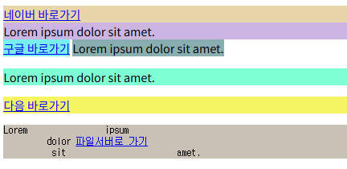

* **`ex01-07.html`**

 

## ex02

* **`ex02-01.html`**
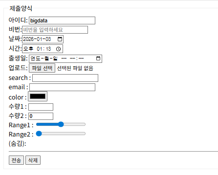

* **`ex02-06.html`**
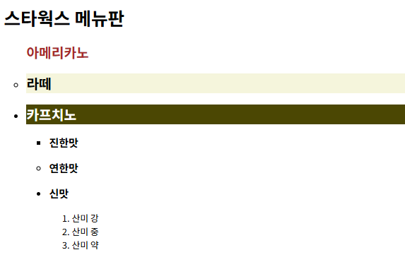

* **`ex02-08.html`**
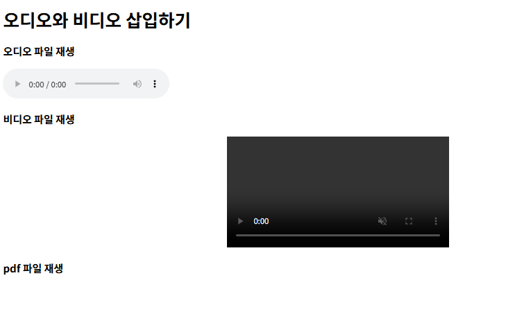
 

## ex03

* **`ex03-01.html`**
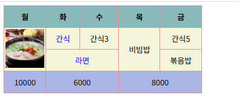

* **`ex03-04.html`**

 

## ex04

* **`ex04-01.html`**
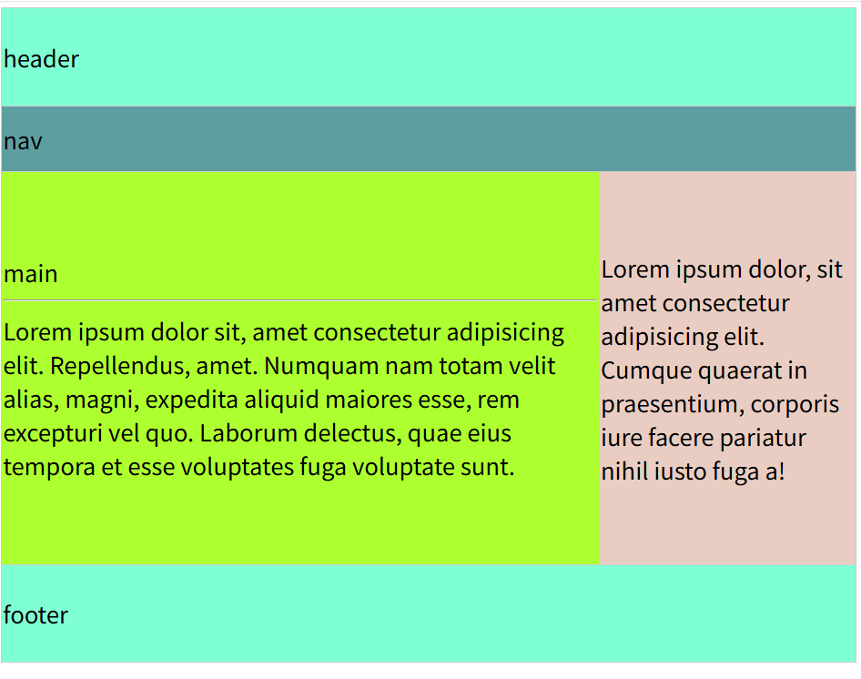

* **`ex04-10.html`**
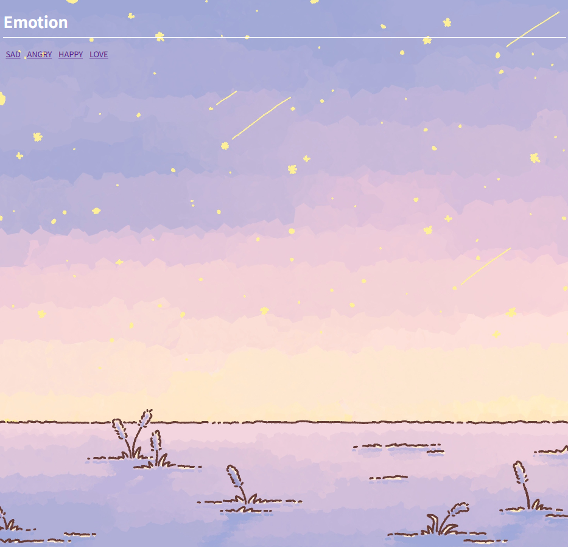
 

## ex05

* **`ex05-07.html`**

* **`ex05-09a.html`**
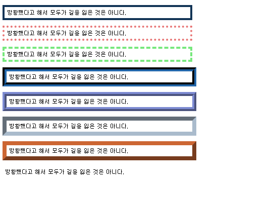

 

## ex06

- **`ex06-02.html`**
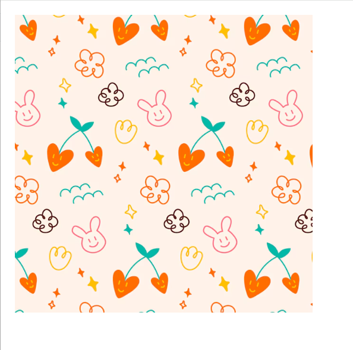

- **`ex06-05.html`**
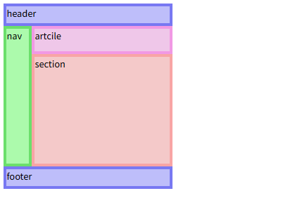

 

## ex07

- **`ex07-01.html`**
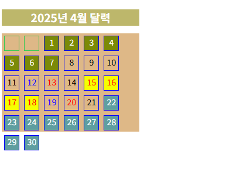

- **`ex07-04.html`**
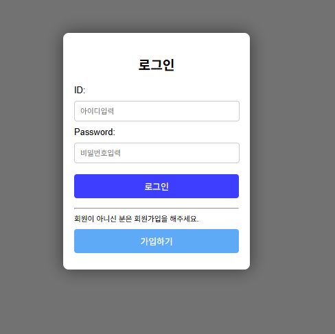

 

## ex08

- **`ex08-01.html`**
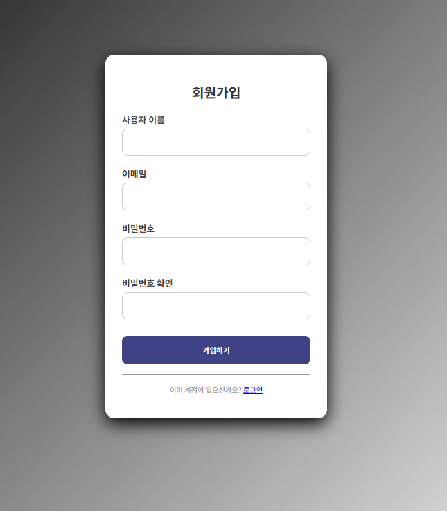

- **`ex08-10.html`**

 

## ex09

- **`ex09-07.html`**

- **`ex09-08a.html`**
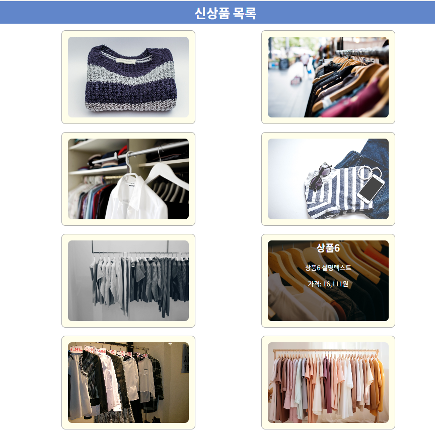

 

## ex10
- **`ex10-02.html`**
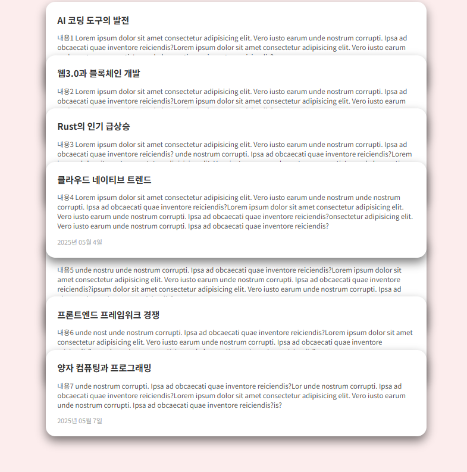

- **`ex10-06.html`**
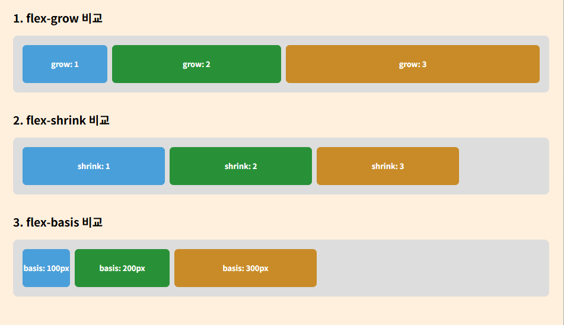

- **`ex10-08a.html`**
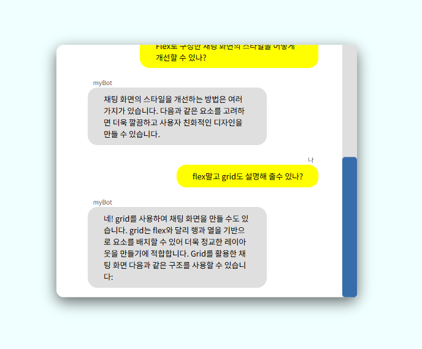

 

## ex11

- **`ex11-06.html`**
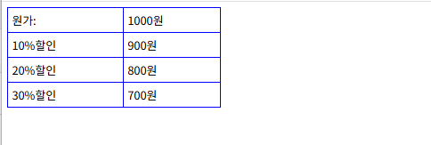

 

## ex12

- **`ex12-01.html`**
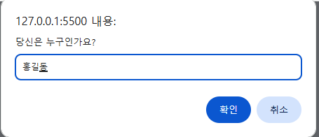

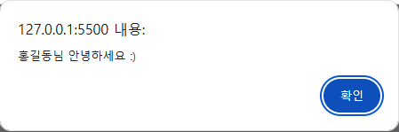

 

## ex13

- **`ex13-01.html`**

- **`ex13-03c.html`**
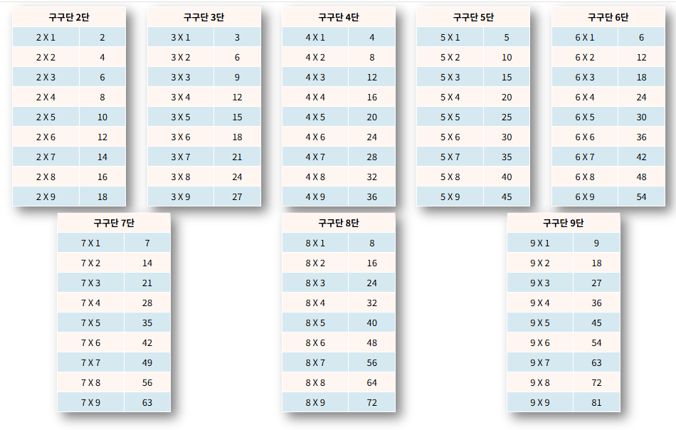
 

## ex14

- **`ex14-01.html`**
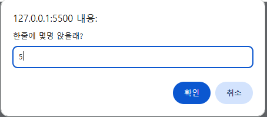

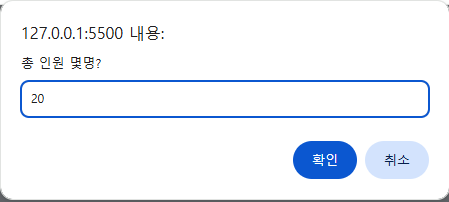

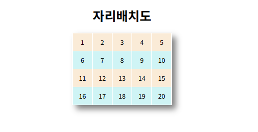

- **`ex14-04c.html`**
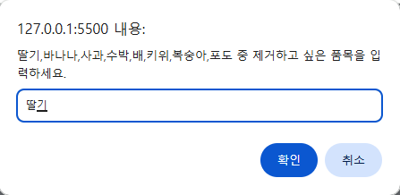

 

## ex15

- **`ex15-02b.html`**
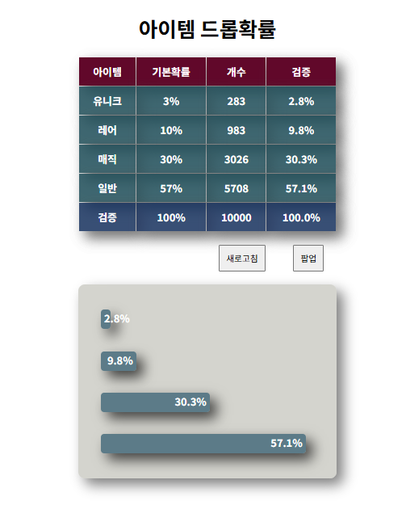
 

## ex16

- **`ex16-01.html`**

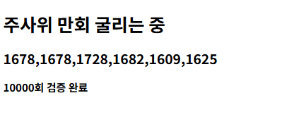

- **`ex16-03.html`**
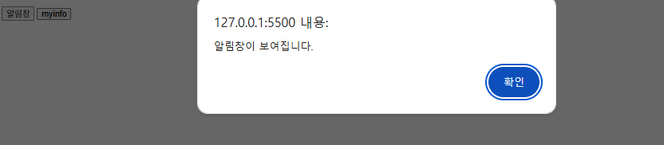
 

## ex17
- **`ex17-01.html`**
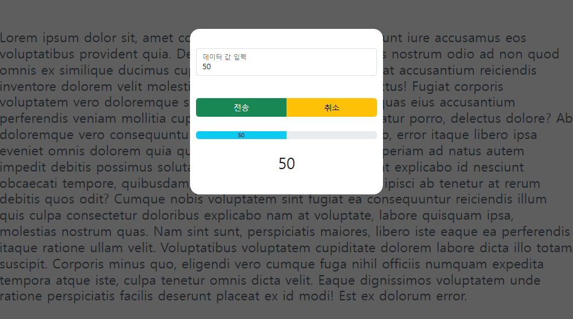

- **`ex17-03.html`**
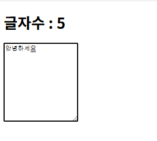
 

## ex18

- **`ex18-03a.html`**

 

## ex19

- **`ex19-01d.html`**

 

## ex20

- **`ex20-03b.html`**
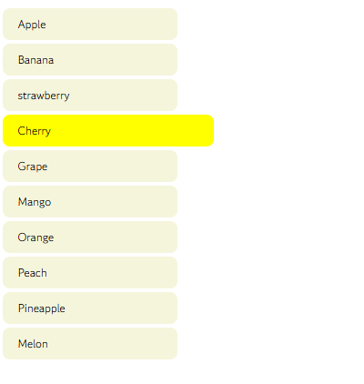
 

## ex21

- **`ex21-01b.html`**

- **`ex21-02c.html`**
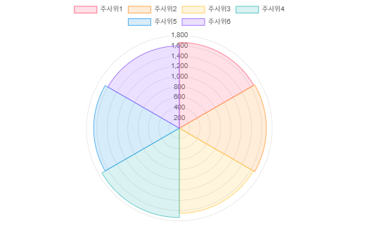
 

## ex22

- **`ex22-03a.html`**
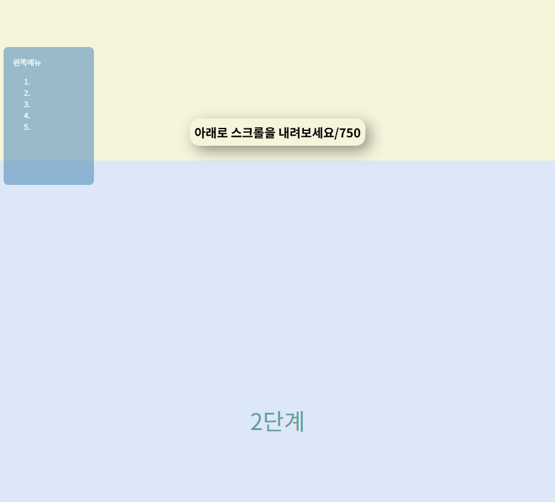
 

## ex23

- **`ex23-02.html`**

 

## ex24

- **`ex24-01.html`**

