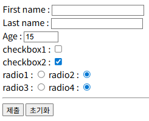

# HTML 예제

이 프로젝트는 다양한 HTML 예제 목록 다루고 있습니다. 아래는 주요 예제들에 해당하는 실행화면입니다.

* **`ex01-01.html`**
* **`ex01-02.html`**
* **`ex01-03.html`**
- **`ex01-04.html`**

  

* **`ex01-05.html`**
* **`ex01-06.html`**
* **`ex01-07.html`**

  

* **`ex01-08.html`**
* **`ex01-09.html`**

  

## ex02

* **`ex02-01.html`**
* **`ex02-01a0.html`**
* **`ex02-02.html`**
* **`ex02-03.html`**
* **`ex02-04.html`**
* **`ex02-05.html`**
* **`ex02-06.html`**
* **`ex02-06a.html`**
* **`ex02-07.html`**
* **`ex02-08.html`**
* **`ex02-09.html`**
* **`ex02-09a.html`**

## ex03

* **`ex03-01.html`**
* **`ex03-01a.html`**
* **`ex03-02.html`**
* **`ex03-03.html`**
* **`ex03-04.html`**

## ex04

* **`ex04-01.html`**
* **`ex04-02.css`**
* **`ex04-02.html`**
* **`ex04-03.html`**
* **`ex04-04.html`**
* **`ex04-05.html`**
* **`ex04-06.html`**
* **`ex04-06a.html`**
* **`ex04-06b.html`**
* **`ex04-06c.html`**
* **`ex04-07.html`**
* **`ex04-08.html`**
* **`ex04-09.html`**
* **`ex04-10.html`**

## ex05

* **`ex05-01.html`**
* **`ex05-02.html`**
* **`ex05-03.html`**
* **`ex05-04.html`**
* **`ex05-05.html`**
* **`ex05-06.html`**
* **`ex05-07.html`**
* **`ex05-08.html`**
* **`ex05-08a.html`**
* **`ex05-09.html`**
* **`ex05-09a.html`**
* **`ex05-09b.html`**
* **`ex05-10.html`**
* **`ex05-10a.html`**
* **`ex05-10b.html`**
* **`ex05-11.html`**
* **`ex05-11a.html`**
* **`ex05-12.html`**
* **`ex05-13.html`**
* **`ex05-13a.html`**
* **`ex05-14.html`**

