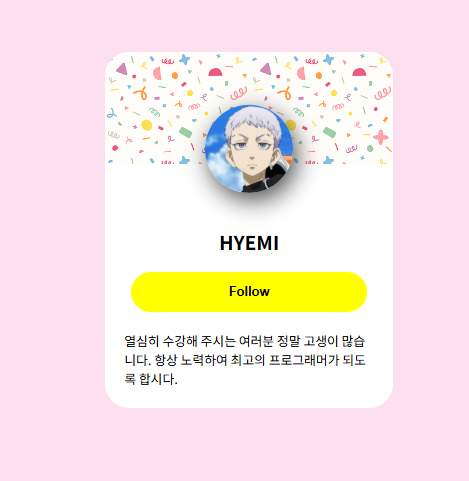

# HTML 예제

이 프로젝트는 다양한 HTML 예제 목록 다루고 있습니다. 아래는 주요 예제들에 해당하는 실행화면입니다.

## ex01

* **`ex01-01.html`**
* **`ex01-02.html`**
* **`ex01-03.html`**
* **`ex01-04.html`**

* **`ex01-05.html`**
* **`ex01-06.html`**
* **`ex01-07.html`**

* **`ex01-08.html`**
* **`ex01-09.html`**
 

## ex02

* **`ex02-01.html`**

* **`ex02-01a0.html`**
* **`ex02-02.html`**
* **`ex02-03.html`**
* **`ex02-04.html`**
* **`ex02-05.html`**
* **`ex02-06.html`**

* **`ex02-06a.html`**
* **`ex02-07.html`**
* **`ex02-08.html`**

* **`ex02-09.html`**
* **`ex02-09a.html`**

## ex03

* **`ex03-01.html`**

* **`ex03-01a.html`**
* **`ex03-02.html`**
* **`ex03-03.html`**
* **`ex03-04.html`**

## ex04

* **`ex04-01.html`**

* **`ex04-02.css`**
* **`ex04-02.html`**
* **`ex04-03.html`**
* **`ex04-04.html`**
* **`ex04-05.html`**
* **`ex04-06.html`**
* **`ex04-06a.html`**
* **`ex04-06b.html`**
* **`ex04-06c.html`**
* **`ex04-07.html`**
* **`ex04-08.html`**
* **`ex04-09.html`**
* **`ex04-10.html`**

## ex05

* **`ex05-01.html`**
* **`ex05-02.html`**
* **`ex05-03.html`**
* **`ex05-04.html`**
* **`ex05-05.html`**
* **`ex05-06.html`**
* **`ex05-07.html`**

* **`ex05-08.html`**
* **`ex05-08a.html`**
* **`ex05-09.html`**
* **`ex05-09a.html`**

* **`ex05-09b.html`**
* **`ex05-10.html`**
* **`ex05-10a.html`**
* **`ex05-10b.html`**
* **`ex05-11.html`**
* **`ex05-11a.html`**
* **`ex05-12.html`**
* **`ex05-13.html`**

  ### ex06
- **`ex06-01.html`**
- **`ex06-02.html`**

- **`ex06-02a.html`**
- **`ex06-02b.html`**
- **`ex06-03.html`**
- **`ex06-04.html`**
- **`ex06-04a.html`**
- **`ex06-05.html`**

- **`ex06-05linear-1.html`**
- **`ex06-05linear-2.html`**
- **`ex06-05linear-3.html`**
- **`ex06-05pattern.html`**
- **`ex06-05radial-1.html`**
- **`ex06-05radial-3.html`**
- **`ex06-05radial-4.html`**
- **`ex06-05repeating.html`**
- **`ex06-06.html`**
- **`ex06-07.html`**
- **`ex06-08.html`**
- **`ex06-08a.html`**

### ex07
- **`ex07-01.html`**

- **`ex07-01a.html`**
- **`ex07-02.html`**
- **`ex07-03.html`**
- **`ex07-04.html`**

### ex08
- **`ex08-01.html`**

- **`ex08-02.html`**
- **`ex08-03.html`**
- **`ex08-03a.html`**
- **`ex08-04.html`**
- **`ex08-05.html`**
- **`ex08-06.html`**
- **`ex08-07.html`**
- **`ex08-08.html`**
- **`ex08-08a.html`**
- **`ex08-08b.html`**
- **`ex08-09.html`**
- **`ex08-10.html`**

- **`ex08-11.html`**
- **`ex08-12.html`**

### ex09
- **`ex09-01.html`**
- **`ex09-02.html`**
- **`ex09-03.html`**
- **`ex09-04.html`**
- **`ex09-04a.html`**
- **`ex09-05.html`**
- **`ex09-06.html`**
- **`ex09-07.html`**

- **`ex09-08.html`**
- **`ex09-08a.html`**

- **`ex09-09.html`**
- **`ex09-10.html`**

### ex10
- **`ex10-01.html`**
- **`ex10-02.html`**

- **`ex10-03.html`**
- **`ex10-04.html`**
- **`ex10-05a.html`**
- **`ex10-05b.html`**
- **`ex10-05c.html`**
- **`ex10-06.html`**

- **`ex10-06a.html`**
- **`ex10-07.html`**
- **`ex10-08.html`**
- **`ex10-08a.html`**

- **`ex10-09.html`**
- **`ex10-09a.html`**

